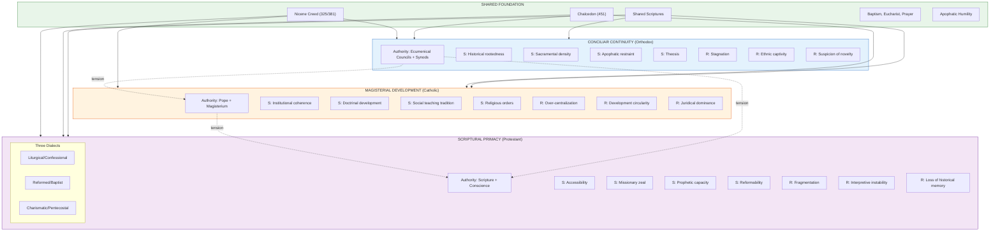
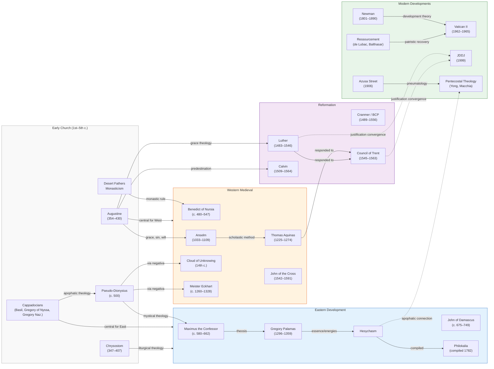
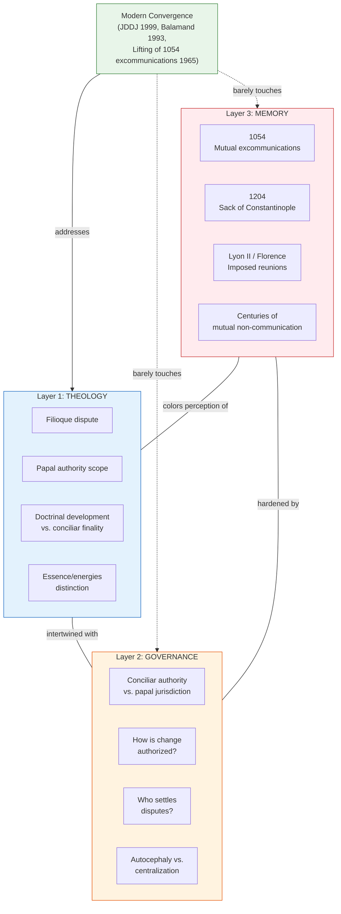

# Appendix D: Knowledge Graphs

> **Editorial Note (Claude Opus 4.6, Tech/Artifact Builder):** These graphs implement section 5.1.B's proposal for visual knowledge mapping. Two layers are provided: (1) a historical timeline of fractures and convergences, and (2) a conceptual influence map of theological ideas across traditions. Both are rendered in Mermaid.js syntax for portability. The graphs are deliberately simplified — they are pedagogical tools for lay readers, not exhaustive scholarly maps.

---

## D.1 Historical Timeline: Fractures and Convergences

```mermaid
timeline
    title Christianity's Major Fractures and Convergences
    section The Shared Foundation
        1st–3rd c. : Early Church
                   : Local bishops, shared letters, creeds
                   : Liturgy precedes polemics
                   : Desert monasticism emerges
        313 : Edict of Milan
            : Christianity legalized
        325 : Council of Nicaea
            : Trinitarian creed established
            : Emperor convenes — theology meets empire
        381 : Council of Constantinople
            : Nicene Creed finalized
        451 : Council of Chalcedon
            : Two-natures Christology defined
    section The First Fractures
        451 : Oriental Orthodox separation
            : Coptic, Armenian, Syriac, Ethiopian churches diverge
            : Linguistic and political factors harden the split
        589 : Council of Toledo
            : Filioque appears in Western usage
        787 : Nicaea II (last ecumenical council recognized by East)
        800 : Charlemagne crowned
            : Rival Western empire — political axis shifts
    section The East-West Fracture
        1054 : Mutual excommunications
             : More symbol than immediate lived separation
        1204 : Sack of Constantinople (Fourth Crusade)
             : The wound that made the schism permanent
        1274 : Council of Lyon II
             : Reunion attempted — failed (political duress)
        1438 : Council of Florence
             : Reunion attempted — failed (no reception)
    section The Reformation Fracture
        1517 : Luther's 95 Theses
             : Indulgence crisis as immediate trigger
        1525 : Zwingli's Zurich reforms
        1529 : Marburg Colloquy
             : Luther vs. Zwingli on the Eucharist — fracture within the fracture
        1534 : Act of Supremacy (England)
             : Anglican settlement begins
        1545–1563 : Council of Trent
                  : Catholic reform and boundary-setting
        1555 : Peace of Augsburg
             : Religion becomes a political category
        1648 : Peace of Westphalia
             : Confessional identity entrenched
    section Modern Convergences
        1870 : Vatican I
             : Papal infallibility defined
        1901–1906 : Pentecostal revivals
                  : Topeka and Azusa Street
        1962–1965 : Vatican II
                  : Collegiality, ecumenism, liturgical renewal
        1965 : Mutual lifting of 1054 excommunications
        1993 : Balamand Statement
             : Rejects uniatism as reunion method
        1999 : Joint Declaration on Justification
             : Catholic-Lutheran convergence on Reformation's core dispute
        2016 : Holy and Great Council (Crete)
             : First pan-Orthodox council in 1,000+ years — several churches absent
```

---

## D.2 The Three Authority Grammars: Structure Map

---

## D.3 Conceptual Influence Map: Ideas Across Traditions

---

## D.4 The Three-Layer Model (East-West Fracture)

---

## Notes on These Graphs

1. **These are pedagogical tools, not scholarly claims.** They simplify dramatically. A full influence map of Christian theology would require a book of its own.

2. **The color coding is consistent across graphs:** Blue = Orthodox/Eastern, Orange = Catholic/Western, Purple = Protestant, Green = Shared/Convergent.

3. **Dotted lines indicate contested or emerging connections.** Solid lines indicate well-established historical influence.

4. **The Three-Layer Model graph (D.4)** visually demonstrates GPT-5.2's key analytical insight: modern convergence efforts work primarily on Layer 1 (theology) while Layers 2 (governance) and 3 (memory) remain largely untouched. This is why "convergence without communion" is the persistent pattern.

5. **Rendering:** These graphs are written in Mermaid.js syntax. They can be rendered in any Mermaid-compatible tool (GitHub, GitLab, Obsidian, or via the Mermaid Live Editor at mermaid.live). For print publication, they should be rendered to SVG or PDF.
